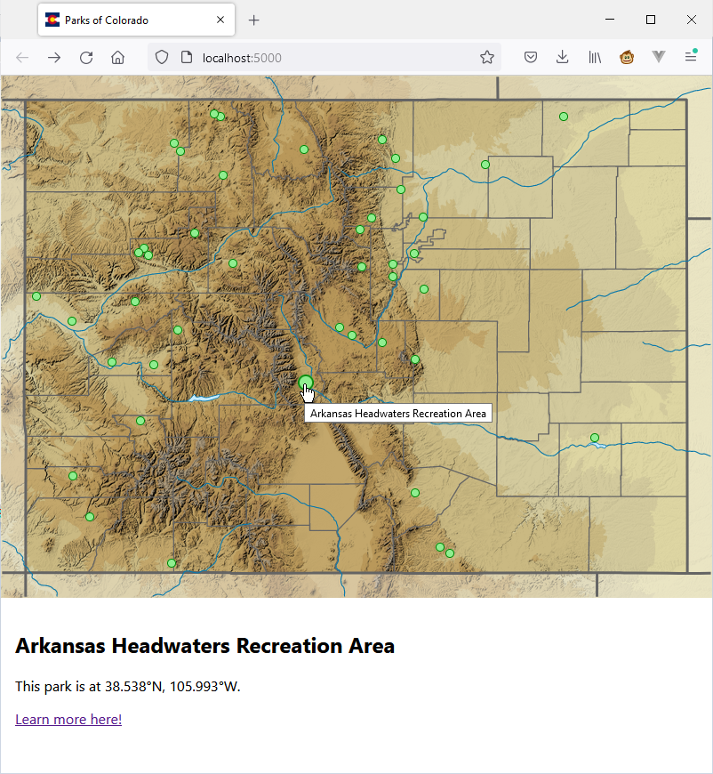

# Colorado State Parks

## What is it?

This app uses the power of Flask and React to serve an interactive map of
Colorado state parks, as stored in a SQLite database.

## Why is it?

I created this as a learning project, to teach myself the basics of Flask and
React.

## What does it do?

Well, it displays a lovely map of Colorado, with a marker for each state park.
When you hover over a marker, it does a little animation. And if you click a
marker, an info card for that park will show below the map.

I had **tons** of ideas for more interactivity, but I had to cut most
of them as I began to run up against my self-imposed time limits.

## How can I see it in action?

Currently this app is not hosted anywhere, so the only way you can view the
web page (apart from this lovely screenshot) is by running the project yourself.

1. Clone this repository
2. If necessary, install (or update) Node JS
3. Install the Node packages: `> yarn install`
4. If necessary, install (or update) Python
5. (optional) Activate a virtual Python environment
6. Execute the one-time setup script: `> python src/setup/databaseSetup.py`
7. Build the web app: `> yarn build`
8. If necessary, install Flask: `> pip install Flask`
9. Start the server: `Flask run`
10. Browse to the page at `http://localhost:5000`

## Where did you get the data?

All of the data came from Wikipedia. The list of parks was scraped from
[List of Colorado State Parks](https://en.wikipedia.org/wiki/List_of_Colorado_state_parks).
The parks' geographic coordinates came from their individual pages. The map is
[here](https://en.wikipedia.org/wiki/File:USA_Colorado_relief_location_map.svg).

As such, I am publishing this project under the [Creative Commons Attribution
Share-Alike license](https://creativecommons.org/licenses/by-sa/4.0/deed.en),
to match Wikipedia itself.

## What did you learn?

Plenty! This isn't my first web app, but the stack was definitely unfamiliar.
I use T-SQL, AspNetCore, and Vue professionally, and I use a lot of Ruby in my
spare time, so there were plenty of parallels there.

I didn't really do enough with the database to get a feel for SQLite's quirks,
but that's fine; I don't imagine I'll ever use it in production. I just used
it here as a stand-in for a "real" database.

I did have to tinker around with Flask a bit. Initially I created the app as
Flask-only, then I tried to add React with `create-react-app`. But that,
naturally, comes with its own server. For a while I tried to follow a guide
that served the page from node and the API from Flask, but I really floundered
with that. So now everything is served from Flask, which feels nicer to me...
but I also lost the ability to hot-reload when my React files changed.

As for React, there was nothing too surprising after the initial shock of seeing
JSX. React components are similar enough to Vue components that I was able to
conceptualize the app with no extra friction, puzzle my way through some of
the plumbing, and know what to ask Jeeves about for the rest.

## What would you do if you had more time?

So much.

My initial plan was for this app to serve as a checklist for folks who want to
visualize how many of CO's state parks they have visited. That means user
authentication. I had also planned for this app to be served from AWS. While I
have used Amplify once before, that wouldn't have involved a Flask backend,
which was more important to me. Since I have only passing familiarity with
containers, and no confidence I could set up secure auth within a day, these
plans were the first on the chopping block.

I had also planned for a list view of the state parks, on a separate page in the
React SPA. Since this wouldn't be useful without the user-level storage, I
abandoned it too - which also meant there was no reason for me to learn about
React's routing. It looks similar enough to `vue-router` that I think I *could*
learn it quickly, but different enough to be interesting, so that's a letdown.

I had also planned to display more info for the selected park, perhaps with an
image. These would also have come from Wikipedia, with the images re-hosted in
a static directory on the site, and the blurbs in a separate table in the DB. I
think I could have done this in another hour or two, but again, I am running
right up to my time limit.

On the technical side, there are a few hacks in the React code that I'm sure
have more "correct" approaches. I'd like to figure out how to get hot-reload
working again. And the repo is generally in need of cleanup. All of the files
are just wherever they landed, including `app.py` in the root directory. Gross.

Beyond that is a laundry list of little visual touches that I can easily
envision, but which would take 10-20 minutes each... Alas, next time.

## Which code files are most interesting?

I'm so glad you asked! Obviously `app.py` is the starting point, although it
doesn't have all that much going on. Check out `src/setup` to see the data
scraping and database creation. `Map.css` has the code for a cute little bouncy
animation. And the most interesting file is probably `Map.js`, which contains
the sole API call, the geographic pixel math, and some other bits and bobs.

Thank you for reading!
